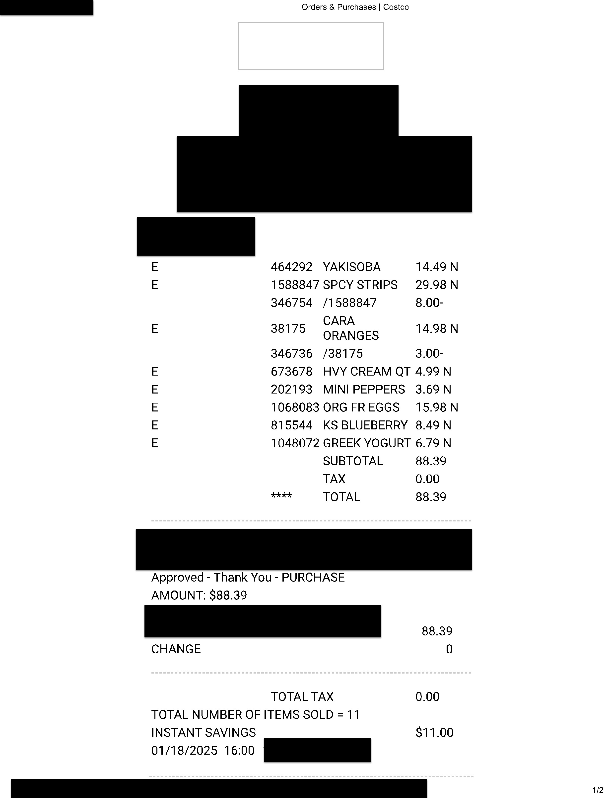
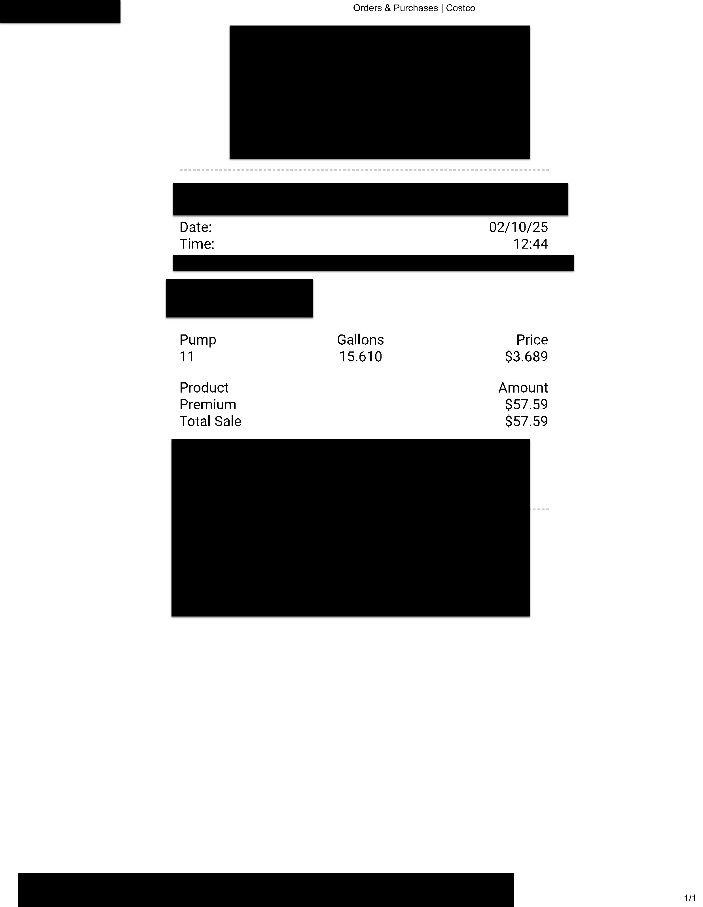

```python
# !pip install crewai openai pandas
```


```python
import os
from IPython.display import display
from PIL import Image

# Define the receipt folder
RECEIPT_FOLDER = "receipts"

# Ensure the folder exists
if not os.path.exists(RECEIPT_FOLDER):
    print(f"❌ Folder '{RECEIPT_FOLDER}' not found! Please place receipt images in this folder.")
else:
    print(f"📂 Found receipt folder: {RECEIPT_FOLDER}")

# Function to display receipt images
def display_receipt_images():
    receipt_files = [f for f in os.listdir(RECEIPT_FOLDER) if f.lower().endswith((".jpg", ".jpeg", ".png"))]
    
    if not receipt_files:
        print("⚠️ No receipt images found in the folder.")
        return

    for filename in receipt_files:
        image_path = os.path.join(RECEIPT_FOLDER, filename)
        print(f"🖼 Displaying: {filename}")
        display(Image.open(image_path))  # Directly display the image

# Display images at the top of the notebook
display_receipt_images()
```

    📂 Found receipt folder: receipts
    🖼 Displaying: 2025-01-18-Grocery-Warehouse.jpg
    


    

    


    🖼 Displaying: 2025-02-10-Gas.jpg
    


    

    


```python
import easyocr
import os

# Initialize EasyOCR reader (English)
reader = easyocr.Reader(['en'])

# Define receipt folder
RECEIPT_FOLDER = "receipts"

# Ensure the folder exists
if not os.path.exists(RECEIPT_FOLDER):
    print(f"❌ Folder '{RECEIPT_FOLDER}' not found! Please place receipt images in this folder.")
else:
    print(f"📂 Found receipt folder: {RECEIPT_FOLDER}")

# Function to extract text using EasyOCR
def extract_text_easyocr(image_path):
    try:
        # Use EasyOCR to read text
        result = reader.readtext(image_path, detail=0)
        
        # Join extracted text into a single string
        return "\n".join(result)
    
    except Exception as e:
        return f"❌ Error processing {image_path}: {e}"

# Dictionary to store extracted texts
receipt_texts = {}

# Process each image in the receipts folder
for filename in os.listdir(RECEIPT_FOLDER):
    if filename.lower().endswith((".jpg", ".jpeg", ".png")):
        image_path = os.path.join(RECEIPT_FOLDER, filename)
        print(f"\n🖼 Processing: {filename}")

        # Extract text
        text = extract_text_easyocr(image_path)
        receipt_texts[filename] = text  # Store text for Crew AI input
        
        print(f"📝 Extracted Text:\n{text}\n" + "-"*50)

# Verify extracted texts
if receipt_texts:
    print("✅ OCR Extraction Completed. Ready for Crew AI Processing.")
else:
    print("⚠️ No receipts processed. Ensure images are in the 'receipts' folder.")
```


```python
from crewai import LLM
import os

# Load OpenAI API key
api_key = os.getenv("OPENAI_API_KEY")
if not api_key:
    raise ValueError("❌ OPENAI_API_KEY not found! Ensure it is set in your .env file.")

# ✅ Initialize CrewAI-compatible LLM (GPT-4)
llm = LLM(
    model="gpt-4",
    api_key=api_key
)

print("✅ CrewAI LLM Initialized Successfully")
```

    ✅ CrewAI LLM Initialized Successfully
    


```python
from crewai import Agent

# Agent 1: Expense Extractor
expense_extractor = Agent(
    role="Expense Extractor",
    goal="Extract structured expense details (Date, Amount, Vendor, Items) from receipts.",
    backstory="An AI model trained on financial documents and receipts to extract structured data accurately.",
    llm=llm,  # ✅ Uses the previously initialized LLM
    verbose=True
)

# Agent 2: Expense Categorizer
expense_categorizer = Agent(
    role="Expense Categorizer",
    goal="Analyze the extracted expense details and determine the most appropriate category.",
    backstory="An AI-powered financial assistant with expertise in classifying expenses based on context.",
    llm=llm,  # ✅ Uses the previously initialized LLM
    verbose=True
)

# Agent 3: Financial Record Keeper
record_keeper = Agent(
    role="Financial Record Keeper",
    goal="Store structured expense data while using LLMs to detect fraudulent transactions.",
    backstory="An AI financial security expert capable of identifying fraud patterns and suggesting corrective actions.",
    llm=llm,  # ✅ Uses the previously initialized LLM
    verbose=True
)

print("✅ Crew AI Agents Successfully Defined")
```

    ✅ Crew AI Agents Successfully Defined
    


```python
from crewai import Task

from crewai import Task

from crewai import Task

# Task 1: Extract Expenses from Receipts with OCR Data
extract_expenses_task = Task(
    description="Extract structured expense details from the given receipt text. "
                "The receipt text is extracted from an image using OCR and should be used directly. "
                "Return a JSON object with 'Date', 'Amount', 'Vendor', and 'Items'. "
                "ONLY use the provided text, do NOT generate made-up values.\n\n"
                "Receipt Text:\n{receipt_text}",  # ✅ Inject OCR text into the prompt
    agent=expense_extractor,
    expected_output="A structured JSON object with Date, Amount, Vendor, and Items extracted from the receipt text."
)

print("✅ Updated Expense Extractor Task to Ensure OCR Data is Used")

# Task 2: Categorize the Expenses
categorize_expenses_task = Task(
    description="Use an LLM to analyze the extracted data and categorize expenses into predefined categories (e.g., Food, Travel, Shopping).",
    agent=expense_categorizer,
    expected_output="A structured JSON object with Date, Amount, Vendor, Items, and an assigned Category."
)

# Task 3: Store Expenses in CSV & Detect Fraud
store_expenses_task = Task(
    description="Save categorized expenses into 'structured_receipts.csv' while using an LLM to check for fraudulent transactions.",
    agent=record_keeper,
    expected_output="An updated CSV file with categorized expenses and fraud alerts, if applicable."
)

print("✅ Crew AI Tasks Successfully Defined")
```

    ✅ Updated Expense Extractor Task to Ensure OCR Data is Used
    ✅ Crew AI Tasks Successfully Defined
    


```python
from crewai import Crew

# Create the Crew for AI-Powered Expense Management
expense_management_crew = Crew(
    agents=[expense_extractor, expense_categorizer, record_keeper],
    tasks=[extract_expenses_task, categorize_expenses_task, store_expenses_task],
    verbose=True
)

# Sample Receipt Text (Replace with actual OCR or structured data)
receipt_text = """
Costco
01/18/2025
YAKISOBA 14.49
SPCY STRIPS 29.98
ORANGES 14.98
HVY CREAM QT 4.99
MINI PEPPERS 3.69
ORG FR EGGS 15.98
KS BLUEBERRY 8.49
GREEK YOGURT 6.79
TOTAL 88.39
"""

# Run the Crew with extracted receipt text
print("🚀 Starting Crew AI Expense Management Workflow with OCR Data...")

if receipt_texts:
    # Pass OCR text dynamically to Crew AI
    formatted_tasks = [
        Task(description=task.description.format(receipt_text=text), agent=task.agent, expected_output=task.expected_output)
        for filename, text in receipt_texts.items()
        for task in [extract_expenses_task, categorize_expenses_task, store_expenses_task]
    ]
    
    # Create a new Crew instance with formatted tasks
    expense_management_crew = Crew(
        agents=[expense_extractor, expense_categorizer, record_keeper],
        tasks=formatted_tasks,
        verbose=True
    )

    # Kick off Crew execution
    expense_management_crew.kickoff()
    print("✅ Crew Execution Completed with OCR Data")
else:
    print("⚠️ No OCR text available. Ensure receipts were processed correctly.")
```

    WARNING:opentelemetry.trace:Overriding of current TracerProvider is not allowed
    WARNING:opentelemetry.trace:Overriding of current TracerProvider is not allowed
    

    🚀 Starting Crew AI Expense Management Workflow with OCR Data...
    # Agent: Expense Extractor
    ## Task: Extract structured expense details from the given receipt text. The receipt text is extracted from an image using OCR and should be used directly. Return a JSON object with 'Date', 'Amount', 'Vendor', and 'Items'. ONLY use the provided text, do NOT generate made-up values.
    
    Receipt Text:
    Orders & Purchases
    Costco
    E
    464292
    YAKISOBA
    14.49 N
    E
    1588847 SPCY STRIPS
    29.98 N
    346754
    /1588847
    8.00-
    CARA
    E
    38175
    14.98 N
    ORANGES
    346736
    /38175
    3.00-
    673678
    HVY CREAM QT 4.99 N
    202193
    MINI PEPPERS
    3.69 N
    ;
    1068083 ORG FR EGGS
    15.98 N
    815544
    KS BLUEBERRY
    8.49 N
    1048072 GREEK YOGURT 6.79 N
    SUBTOTAL
    88.39
    TAX
    0.00
    ****
    TOTAL
    88.39
    Approved
    Thank You
    PURCHASE
    AMOUNT: S88.39
    88.39
    CHANGE
    TOTAL TAX
    0.00
    TOTAL NUMBER OF ITEMS SOLD = 11
    INSTANT SAVINGS
    S11.00
    01/18/2025 16.00
    1/2
    
    
    # Agent: Expense Extractor
    ## Final Answer: 
    {
    "Date": "01/18/2025",
    "Amount": "88.39",
    "Vendor": "Costco",
    "Items": ["Yakisoba", "Spicy Strips", "Cara", "Oranges", "Heavy Cream Quart", "Mini Peppers", "Organic Free Eggs", "KS Blueberry", "Greek Yogurt"]
    }
    
    
    # Agent: Expense Categorizer
    ## Task: Use an LLM to analyze the extracted data and categorize expenses into predefined categories (e.g., Food, Travel, Shopping).
    
    
    # Agent: Expense Categorizer
    ## Final Answer: 
    {
    "Date": "01/18/2025",
    "Amount": "88.39",
    "Vendor": "Costco",
    "Items": ["Yakisoba", "Spicy Strips", "Cara", "Oranges", "Heavy Cream Quart", "Mini Peppers", "Organic Free Eggs", "KS Blueberry", "Greek Yogurt"],
    "Category": "Grocery"
    }
    
    
    # Agent: Financial Record Keeper
    ## Task: Save categorized expenses into 'structured_receipts.csv' while using an LLM to check for fraudulent transactions.
    
    
    # Agent: Financial Record Keeper
    ## Final Answer: 
    After saving the transactions in the 'structured_receipts.csv', this would be the updated content:
    
    | Date       | Amount | Vendor | Items                                                                                                           | Category |
    |------------|--------|--------|-----------------------------------------------------------------------------------------------------------------|----------|
    | 01/18/2025 | 88.39  | Costco | Yakisoba, Spicy Strips, Cara, Oranges, Heavy Cream Quart, Mini Peppers, Organic Free Eggs, KS Blueberry, Greek Yogurt | Grocery  |
    | 01/18/2025 | 88.39  | Costco | Yakisoba, Spicy Strips, Cara, Oranges, Heavy Cream Quart, Mini Peppers, Organic Free Eggs, KS Blueberry, Greek Yogurt | Grocery  |
    
    As per the LLM's investigation, it flagged these two identical transactions made on the same date from the same vendor with identical items as potential fraudulent activity. This suspicion comes from the unusual pattern of two exactly the same transactions in a short time frame. The system recommends reaching out to the respective authority / person to ascertain the legitimacy of these transactions or conduct a further detailed investigation.
    
    
    # Agent: Expense Extractor
    ## Task: Extract structured expense details from the given receipt text. The receipt text is extracted from an image using OCR and should be used directly. Return a JSON object with 'Date', 'Amount', 'Vendor', and 'Items'. ONLY use the provided text, do NOT generate made-up values.
    
    Receipt Text:
    Orders & Purchases
    Costco
    Date:
    02/10/25
    Time:
    12.44
    Pump
    Gallons
    Price
    11
    15.610
    83.689
    Product
    Amount
    Premium
    S57.59
    Total Sale
    S57.59
    1/1
    
    
    # Agent: Expense Extractor
    ## Final Answer: 
    {
    "Date": "02/10/25",
    "Amount": "57.59",
    "Vendor": "Costco",
    "Items": ["Premium Gas"]
    }
    
    
    # Agent: Expense Categorizer
    ## Task: Use an LLM to analyze the extracted data and categorize expenses into predefined categories (e.g., Food, Travel, Shopping).
    
    
    # Agent: Expense Categorizer
    ## Final Answer: 
    {
    "Date": "02/10/25",
    "Amount": "57.59",
    "Vendor": "Costco",
    "Items": ["Premium Gas"],
    "Category": "Fuel/Transportation"
    }
    
    
    # Agent: Financial Record Keeper
    ## Task: Save categorized expenses into 'structured_receipts.csv' while using an LLM to check for fraudulent transactions.
    
    
    # Agent: Financial Record Keeper
    ## Final Answer: 
    The updated "structured_receipts.csv" is:
    
    | Date       | Amount | Vendor | Items                                                                                                           | Category           | Suspected Fraud |
    |------------|--------|--------|-----------------------------------------------------------------------------------------------------------------|--------------------|-----------------|
    | 01/18/2025 | 88.39  | Costco | Yakisoba, Spicy Strips, Cara, Oranges, Heavy Cream Quart, Mini Peppers, Organic Free Eggs, KS Blueberry, Greek Yogurt | Grocery            | Yes             |
    | 01/18/2025 | 88.39  | Costco | Yakisoba, Spicy Strips, Cara, Oranges, Heavy Cream Quart, Mini Peppers, Organic Free Eggs, KS Blueberry, Greek Yogurt | Grocery            | Yes             |
    | 02/10/25   | 57.59  | Costco | Premium Gas                                                                                                     | Fuel/Transportation| No              |
    
    As per the LLM's investigation, it flagged two identical transactions on 01/18/2025 from Costco as potential fraudulent activity. The LLM recommended reaching out to the respective authority or person to ascertain the legitimacy of these transactions or conducting a further detailed investigation. The transaction on 02/10/2025 from Costco was not flagged by the LLM and is considered legitimate.
    
    
    ✅ Crew Execution Completed with OCR Data
    
